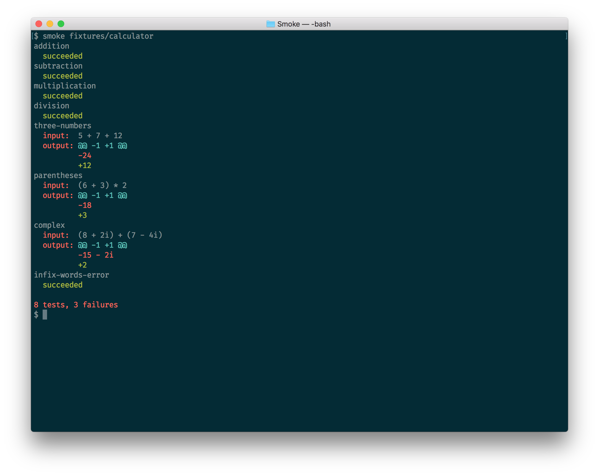

 

# Smoke

_An integration test framework for practically anything._

Smoke is designed to test anything that can be wrapped with a command-line interface. In practice, this amounts to almost any application or large piece of code. Whatever you're working on, no matter how big or complicated, you can usually wrap a CLI around it with minimum effort.

Smoke works especially well for testing large applications, especially after the fact. It allows you to create regression tests, [golden master tests][testing legacy code with golden master], and other things that make refactoring a legacy application much easier.

It's not a replacement for other, smaller tests. We recommend writing unit tests ([perhaps even first][test-driven development]), especially for new code.

[testing legacy code with golden master]: https://craftedsw.blogspot.co.uk/2012/11/testing-legacy-code-with-golden-master.html
[test-driven development]: https://en.wikipedia.org/wiki/Test-driven_development

## Installation

Currently, Smoke is in alpha, and as such is not packaged. You will need to build it yourself.

1.  Install [Stack][], which we will use to compile the Haskell code.
2.  Clone the repository and `cd` into the directory.
3.  Run `stack setup` to download the correct version of GHC.
4.  Run `stack install --local-bin-path=out/build` to build the application.
5.  Copy the application binary at `out/build/smoke-exe` to wherever you need it to go.

If you are using [Nix][] you can build Smoke via `nix-build`.

Smoke is distributed under [the MIT license][mit license].

[stack]: https://docs.haskellstack.org/en/stable/README/
[nix]: https://nixos.org/nix
[mit license]: http://samirtalwar.mit-license.org/

## Writing Test Cases

A test case consists of _input_ and _expected output_. It's made with a YAML file.

First off, you need to specify the _command_ itself. The command is the program to be run (and any common arguments). It is executed from the current working directory. The command can be overriden for each individual test case too.

Input can come in two forms: _standard input_ and _command-line arguments_.

- Command-line arguments are appended to the command to run it.
- Standard input is piped into the program on execution.

Outputs that can be observed by Smoke consist of _standard output_, _standard error_ and the _exit status_ of the program. These are captured by running the program, then compared to the expected values specified. Any difference results in a test failure.

- Expected standard output is compared with the actual standard output. Alternatively, multiple possible expected outputs can be specified. If there are multiple outputs, a match with any of them will be considered a success.
- Expected standard error works in exactly the same way as expected standard output.
- The expected exit status is a single number between `0` and `255`.

At least one of standard output and standard error must be specified, though it can be empty. If no exit status is specified, it will be assumed to be `0`.

### Example: Calculator

Our simplest calculator test case looks like this. It's a file named *smoke.yaml* (the file basename is a convention; you can name it anything you want ending in *.yaml*).

    command:
      - ruby
      - calculator.rb

    tests:
      - name: addition
        stdin: |
          2 + 2
        stdout: |
          4

That's it.

We might want to assert that certain things fail. For example, postfix notation should fail because the second token is expected to be an operator. In this example, our calculator is expected to produce a semi-reasonable error message and exit with a status of `2` to signify a parsing error.

#### test/postfix-notation-fails.in:

    tests:
      # ...
      - name: postfix-notation-fails
        stdin: |
          5 3 *
        exit-status: 2
        stderr: |
          "3" is not a valid operator.

## Running Tests

In order to run tests against an application, you simply invoke Smoke with the directory containing the tests. Given the tests in the _test_ directory, we would run the tests as follows:

    smoke test

Tests can also be passed on an individual basis:

    smoke test/smoke.yaml@addition test/smoke.yaml@postfix-notation-fails

To override the command, or to specify it on the command line in place of the `command` file, you can use the `--command` option:

    smoke --command='ruby calculator.rb' test

Bear in mind that Smoke simply splits the argument to the `--command` option by whitespace, so quoting, escaping, etc. will not work. For anything complicated, use a file instead.

Smoke will exit with a code of `0` if all tests succeed, or non-zero if any test fails, or if the invocation of Smoke itself was not understood (for example, if no test locations are provided).

Output will be in color if outputting to a terminal. You can force color output on or off with the `--color` and `--no-color` switches.

Enjoy. Any feedback is welcome.

## Origins

We had a problem at work. It was a pretty nice problem to have. We were getting too many job applicants and we needed to screen them quickly. So we put some tests online and pointed the <del>guinea pigs</del> <ins>candidates</ins> at 'em.

We quickly found we had another problem: it was taking a lot of developer time to decide whether we should bring in the furballs for real-life interviews. So one night, while more than a little tipsy, I wrote _Smoke_.

We let our interview candidates write code in whatever they like: Java, C#, Python, Ruby… I needed a test framework that could handle any language under the sun. At first, I thought about ways to crowbar RSpec into running tests for applications in any and all languages. This was a stupid idea. Eventually I decided the only thing every language has in common is the command line: every language can pretty easily support standard input and output (with the obvious exception of Java, which makes everything difficult).

I have to stress that this is not a replacement for looking over people's code. I've invited people for further interview even when failed every one of my test cases, because they understood the problem and mostly solved it. Similarly, someone that passes every case but writes Python like people wrote C in the 80s makes me very sad, despite all the green output from Smoke.

## Contributing

Issues and pull requests are very welcome. Please don't hesitate.

Developers of Smoke pledge to follow the [Contributor Covenant][].

You will need to set up Stack as above, and install a few dependencies:

    make tools

We dog-food. Smoke is tested using itself.

Before committing, these four commands should be run, and any failures should be fixed:

    make build     # Builds the application using Stack.
    make test      # Tests the application using itself, with the tests in the "test" directory.
    make lint      # Lints the code using HLint.
    make reformat  # Reformats the code using hindent.

On Windows, Makefiles don't work very well, so run the commands directly:

    stack install --local-bin-path=out\build
    .\out\build\smoke-exe --command=.\out\build\smoke-exe test
    stack exec -- hlint .
    stack exec -- hindent <file>

Smoke should work on Linux and macOS without any issue. Almost all features should also work on Windows, with the exception of allowing scripts as commands. This is due to a (quite reasonable) limitation of Windows; you can't make text files executable.

[contributor covenant]: http://contributor-covenant.org/version/1/4/
